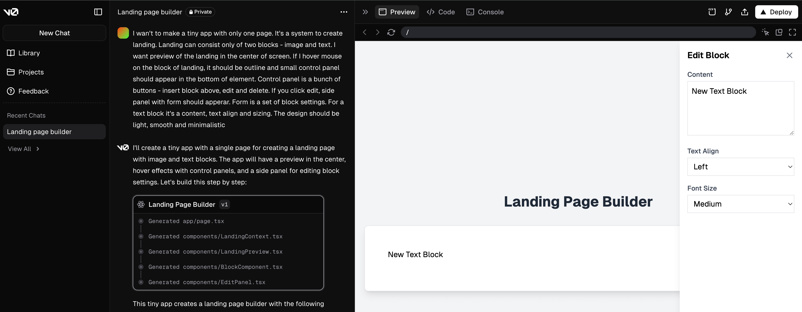
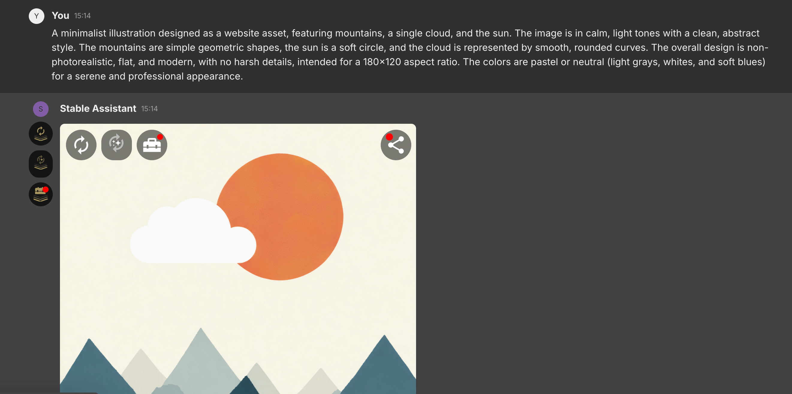
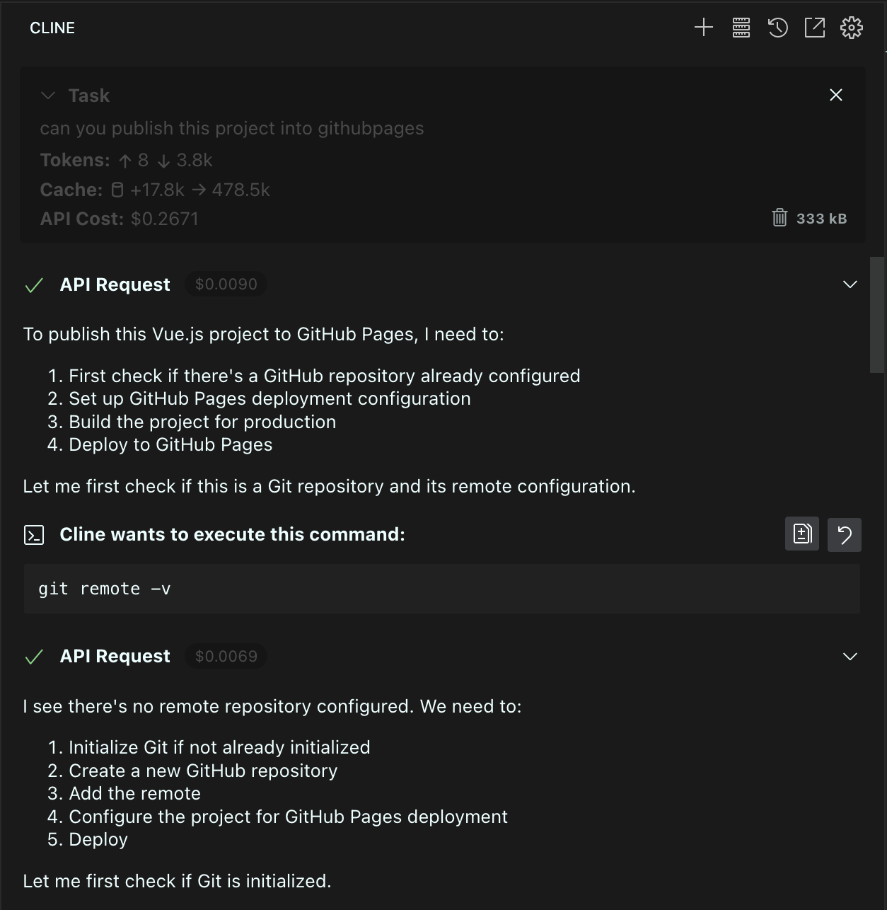
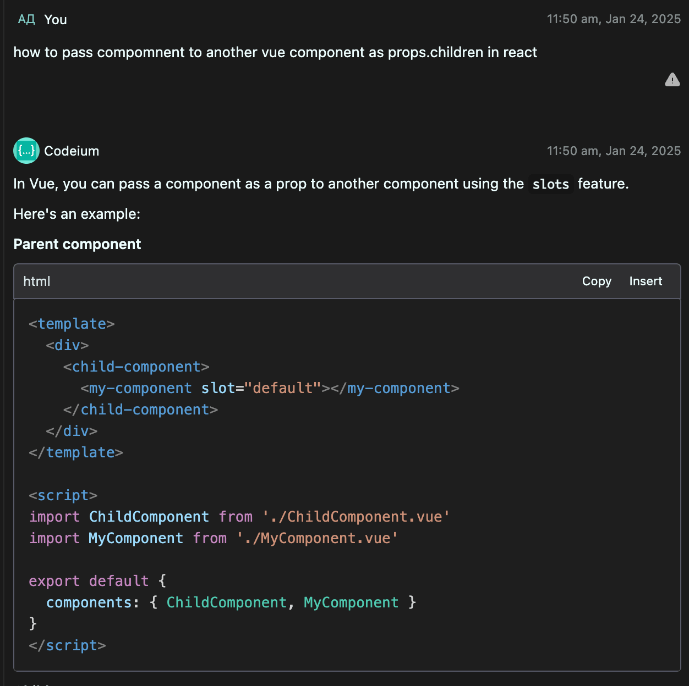

> [!IMPORTANT]  
> Please note that my primary stack is Angular, and I only have a basic understanding of Vue.

# Demo

[Check out the live solution here](https://aleshadk.github.io/js-vue-assignment/)

# Solution Description

The task stated "Create 2 draggable blocks," but I opted for a different approach to adding new elements that I believe is more user-friendly:

- It doesn't disrupt the natural reading flow of the page. Users follow the content down the page, and when they see a spot after block XYZ where they want to add something new, it's just one click away. They get an immediate list of options and don't have to remember where to place the new block. With D'n'D, users would need to look away to the area with draggable items, pick one, and then recall where it needs to go.
- D'n'D is a less stable solution since it increases the chance of user error (e.g., accidentally releasing the mouse) and requires more cognitive load (e.g., combining D'n'D with scrolling).

**That said, since D'n'D was part of the technical requirements, I added support for it to reorder blocks.**

For editing elements, I implemented a side panel with a form. This approach allows endless possibilities for managing content. For example, even a simple "image" block could require multiple properties like `src`, `alt`, `object-fit`, and `margins`.

# Test Scenarios

- Open the app
- Add a text block
- Edit its content and alignment
- Clone the block
- Add an image block, using an external image URL as `src` and an `alt` text
- Provide an invalid `src` for the image
- Delete the image block
- Add another text block
- Open the console and click "Show data in console"
- Reorder the elements using D'n'D
- Open the console again and click "Show data in console"

# Feature Ideas

If we don't consider adding new elements and properties, I’d suggest the following improvements:

- Apply changes instantly when editing a form and allow users to undo them if they click "cancel."
- Add a preview mode toggle (e.g., mobile view, tablet view, etc.).
- Implement an "undo" feature to reverse any action within a few seconds.
- Introduce page-level settings (e.g., default margins for all blocks).
- Allow users to save created blocks for reuse.

# Unit Tests

I wrote several tests for areas where changes could lead to unexpected consequences. Other unit tests seemed redundant since they'd either test trivial reducer logic or external libraries/frameworks. End-to-end (e2e) tests and Storybook would likely provide more value in this case.

# Technologies

**Core**: Vue, Composition API, Typescript, Pinia, Tailwind  
**UI**: Antd, vuedraggable  
**TOOLS**: Vite, vue-tsc, Prettier, ESLint  
**CI/CD**: gh-pages  

# AI Assistants

> [!IMPORTANT]  
> I don’t use AI with repositories for my employer without explicit approval from my manager and the security team.

I primarily used ChatGPT in the past, but I’ve always wanted to explore these tools more deeply. Since Vue is a framework I’m less confident in, this felt like the perfect opportunity.

### v0

I used AI to create a clickable prototype before development. This helped me ensure the interface felt intuitive and pleasant to use.

### Stable Diffusion

I tried generating assets for the app using AI but couldn’t get the desired results.

### Cline + Claude 3.5

This incredible tool helped me generate code, debug issues, and handle routine tasks.

### Codium

An excellent tool that refreshed my memory on basic Vue concepts.

# Known Issues

- There’s a small bug with the D’n’D grab area. Maybe I’ll find time to fix it over the weekend. 😀